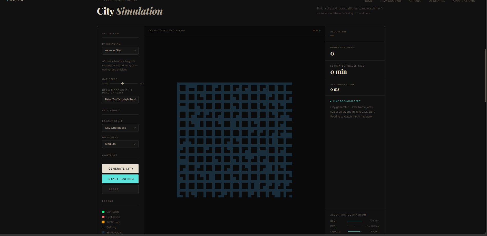
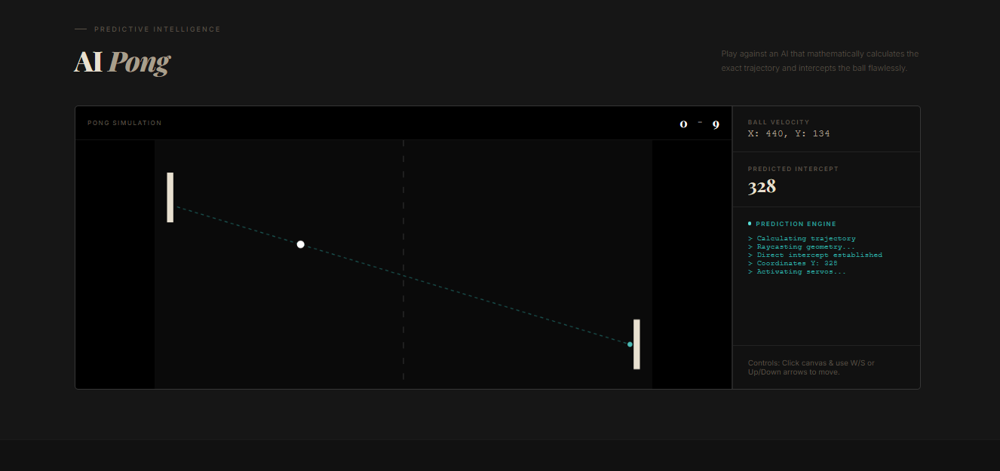
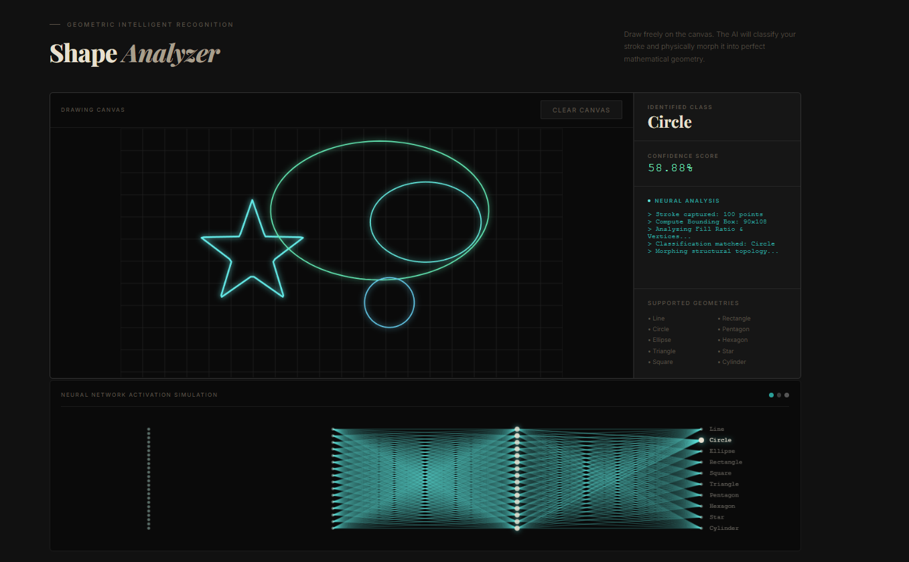

# Algorithms Visualizer

This project contains interactive web applications engineered to help developers and students visualize how foundational computer science algorithms behave. The primary goal is educational: seeing algorithms execute mechanically in real-time allows observers to naturally grasp their logic, edge-cases, and optimization patterns.

Below is an in-depth breakdown of the main algorithms driving the simulation, alongside the actual JavaScript implementations.

---

## 1. City Simulation and Pathfinding (Traffic Routing)


This section demonstrates how graph traversal algorithms find routes on a 2D grid. The grid consists of traversable space (cost 1), traffic jams (cost 5), and impassable building walls.

### Breadth-First Search (BFS)
BFS explores all neighboring nodes level by level. Because it checks all paths of length 1, then all paths of length 2, it guarantees the shortest path on an unweighted grid.

**Primary Behavior:**
* Relies on a Queue (`shift` and `push`), processing the oldest discovered nodes first.
* Ignores movement costs; treats every valid step equally.

```javascript
export function bfs(grid, start, end) {
  const visited = new Set();
  const parent = {};
  const queue = [start];
  visited.add(`${start[0]},${start[1]}`);

  while (queue.length > 0) {
    const [r, c] = queue.shift(); // Dequeue oldest
    const key = `${r},${c}`;

    if (r === end[0] && c === end[1]) {
      return reconstructPath(parent, start, end);
    }

    for (const [dr, dc] of DIRS) {
      const nr = r + dr, nc = c + dc;
      const nk = `${nr},${nc}`;
      
      if (isPassable(grid, nr, nc) && !visited.has(nk)) {
        visited.add(nk);
        parent[nk] = [r, c];
        queue.push([nr, nc]); // Enqueue new neighbors
      }
    }
  }
}
```

### Depth-First Search (DFS)
DFS aggressively plunges down a single path as far as possible before dead-ending and backtracking. 

**Primary Behavior:**
* Uses a Stack (`pop` and `push`), processing the most recently discovered nodes first.
* Terrible for route-finding because it completely ignores distance constraints, but it uses less memory than BFS and is heavily utilized in topological sorting and maze generation combinations.

```javascript
export function dfs(grid, start, end) {
  const visited = new Set();
  const parent = {};
  const stack = [start];

  while (stack.length > 0) {
    const [r, c] = stack.pop(); // Pop newest
    const key = `${r},${c}`;

    if (visited.has(key)) continue;
    visited.add(key);

    if (r === end[0] && c === end[1]) {
      return reconstructPath(parent, start, end);
    }

    for (const [dr, dc] of DIRS) {
      const nr = r + dr, nc = c + dc;
      const nk = `${nr},${nc}`;
      
      if (isPassable(grid, nr, nc) && !visited.has(nk)) {
        if (!parent[nk]) parent[nk] = [r, c];
        stack.push([nr, nc]); // Push new neighbors
      }
    }
  }
}
```

### Dijkstra's Algorithm
Dijkstra's is the backbone of modern mapping. Unlike BFS, it respects varying terrain costs (like painted traffic jams).

**Primary Behavior:**
* Maintains a Priority Queue sorted by the cumulative cost to reach a node.
* Always expands the node with the absolute lowest accumulated cost.
* Guarantees the absolute shortest path factoring in weights.

```javascript
export function dijkstra(grid, start, end) {
  const dist = {};
  const parent = {};
  const visited = new Set();
  const pq = [{ node: start, cost: 0 }];
  dist[`${start[0]},${start[1]}`] = 0;

  while (pq.length > 0) {
    pq.sort((a, b) => a.cost - b.cost); // Priority Queue simulation
    const { node: [r, c], cost } = pq.shift();
    const key = `${r},${c}`;

    if (visited.has(key)) continue;
    visited.add(key);

    if (r === end[0] && c === end[1]) return reconstructPath(parent, start, end);

    for (const [dr, dc] of DIRS) {
      const nr = r + dr, nc = c + dc;
      const nk = `${nr},${nc}`;
      
      if (isPassable(grid, nr, nc) && !visited.has(nk)) {
        // Calculate variable cost based on cell type (traffic vs clear)
        const moveCost = grid[nr][nc] === CELL.TRAFFIC ? 5 : 1;
        const newCost = cost + moveCost;
        
        if (dist[nk] === undefined || newCost < dist[nk]) {
          dist[nk] = newCost;
          parent[nk] = [r, c];
          pq.push({ node: [nr, nc], cost: newCost });
        }
      }
    }
  }
}
```

### A* (A-Star) Search
A* improves upon Dijkstra by adding a heuristic: it estimates the remaining distance to the goal. This forces the algorithm to prioritize moving *toward* the goal rather than expanding equally in all directions.

**Primary Behavior:**
* Priority Queue is sorted by an `f` score, where `f(n) = g(n) + h(n)`.
* `g(n)`: Exact cost from start to node (like Dijkstra).
* `h(n)`: Estimated cost from node to the end (Manhattan distance on grids).

```javascript
function heuristic(a, b) {
  return Math.abs(a[0] - b[0]) + Math.abs(a[1] - b[1]); // Manhattan
}

export function aStar(grid, start, end) {
  const gScore = {};
  const parent = {};
  const visited = new Set();
  const pq = [{ node: start, f: heuristic(start, end) }];
  gScore[`${start[0]},${start[1]}`] = 0;

  while (pq.length > 0) {
    pq.sort((a, b) => a.f - b.f); 
    const { node: [r, c] } = pq.shift();
    const key = `${r},${c}`;

    if (visited.has(key)) continue;
    visited.add(key);

    if (r === end[0] && c === end[1]) return reconstructPath(parent, start, end);

    for (const [dr, dc] of DIRS) {
      const nr = r + dr, nc = c + dc;
      const nk = `${nr},${nc}`;
      
      if (isPassable(grid, nr, nc) && !visited.has(nk)) {
        const moveCost = grid[nr][nc] === CELL.TRAFFIC ? 5 : 1;
        const tentativeG = (gScore[key] ?? Infinity) + moveCost;

        if (tentativeG < (gScore[nk] ?? Infinity)) {
          gScore[nk] = tentativeG;
          parent[nk] = [r, c];
          // f = exact cost so far + estimated cost to destination
          pq.push({ node: [nr, nc], f: tentativeG + heuristic([nr, nc], end) });
        }
      }
    }
  }
}
```

---

## 2. Predictive Pong Engine


This Pong simulation eliminates the traditional "reaction delay". The opponent uses standard kinematics to calculate the ball's exact interception coordinate immediately upon the ball bouncing toward it.

**Primary Behavior:**
* `simX` and `simY` copy the ball's current vector.
* A Raycasting `while` loop mathematically simulates wall bounces (`simVy = -simVy`) instantly until `simX` aligns with the opponent's paddle X-coordinate.
* `predictedY` determines where the paddle physically moves.

```javascript
function updatePrediction() {
  // If moving away, center the paddle and standby
  if (ball.vx <= 0) {
    ai.targetY = height / 2;
    return;
  }

  let simX = ball.x;
  let simY = ball.y;
  let simVx = ball.vx;
  let simVy = ball.vy;
  let steps = 0;

  // Raycast to find exact intercept
  while (simX < ai.x && steps < 10) {
    // Time to reach paddle's X plane
    let tX = (ai.x - ball.radius - simX) / simVx; 
    
    // Time to reach closest vertical wall bounds
    let tY = Infinity;
    if (simVy > 0) tY = (height - ball.radius - simY) / simVy;
    else if (simVy < 0) tY = (ball.radius - simY) / simVy;

    // Fast-forward simulation to nearest collision (paddle or floor/ceiling)
    let t = Math.min(tX, tY);
    simX += simVx * t;
    simY += simVy * t;

    // Did we reach the paddle's plane?
    if (t === tX || Math.abs(tX - tY) < 0.001) {
      predictedY = simY;
      break; 
    } else {
      // Wall bounce: invert Y trajectory, loop continues
      simVy = -simVy;
    }
    steps++;
  }

  // Actuate AI servo targets to coordinate intercept
  if (predictedY !== null) {
    ai.targetY = predictedY;
  }
}
```

---

## 3. Shape Analyzer (Geometric Heuristics)


A functional pipeline for categorizing user-drawn strokes. Instead of relying on a black-box machine learning model, it relies on geometric fundamentals to categorize shapes based on fill ratios, corners, aspect ratios, and bounding boxes.

**Primary Behavior:**
* `polygonArea()` and `getBoundingBox()` capture the core physical limitations of the stroke.
* `Douglas-Peucker (simplify())` drops unneeded points to calculate the number of dominant vertices.
* Compares incoming data metrics against rigid geometric ideals.

```javascript
function recognizeShape(points) {
  // Extract Bounding limitations
  let box = getBoundingBox(points);
  let diag = Math.sqrt(box.W**2 + box.H**2);
  
  // Verify structural connectivity
  let distEnds = distance(points[0], points[points.length-1]);
  let isClosed = distEnds < (diag * 0.25);
  
  // Assess Density Profile
  let area = polygonArea(points);
  let boxArea = box.W * box.H;
  let fillRatio = area / (boxArea || 1); // Ex: Square approaches 1.0, Triangle 0.5
  let ar = box.W / (box.H || 1);
  
  // Calculate corners via simplification logic
  let simplifiedLength = simplify(points, diag * 0.05).length;
  let v = isClosed ? Math.max(3, simplifiedLength - 1) : simplifiedLength;

  let scores = [];
  
  // Master Scoring formula combining metric distances
  function scoreMatch(f, ideal_f, vert, ideal_v, aspectRatio, ideal_ar) {
    let score = 100;
    // Penalty for Fill area deviations
    score -= Math.abs(f - ideal_f) * 150;
    if (ideal_ar !== null) {
      // Penalty for Aspect Ratio variations
      let arDiff = Math.max(aspectRatio/ideal_ar, ideal_ar/aspectRatio) - 1;
      score -= arDiff * 60;
    }
    if (ideal_v !== null && vert !== null) {
      // Vertex exact matching rewards
      if (vert === ideal_v) score += 20;
      else score -= Math.abs(vert - ideal_v) * 10;
    }
    return score;
  }

  // Profile Definitions  
  scores.push({shape: "Square", score: scoreMatch(fillRatio, 0.95, v, 4, ar, 1.0)});
  scores.push({shape: "Rectangle", score: scoreMatch(fillRatio, 0.95, v, 4, ar, ar)});
  scores.push({shape: "Circle", score: scoreMatch(fillRatio, 0.785, null, null, ar, 1.0)});
  scores.push({shape: "Triangle", score: scoreMatch(fillRatio, 0.5, v, 3, ar, ar)});

  scores.sort((a,b) => b.score - a.score);
  return { shape: scores[0].shape, conf: Math.min(99.9, scores[0].score) };
}
```

---

## Practical Applications


Pathfinding mechanics power the logistics of our core infrastructure. Delivery apps use A* on massive road networks to find driver assignments. Computer Networking protocols (like OSPF) rely on Dijkstra variations to route packets across fiber infrastructure. Simulation logic seen above runs natively on autonomous rovers exploring uncharted environments.

---

## Running Locally

1. Clone or download the repository.
2. Ensure you have the `assets/` and `js/` folders alongside `index.html`.
3. Double click `index.html` to open in any web browser. There are no node modules or server requirements.
